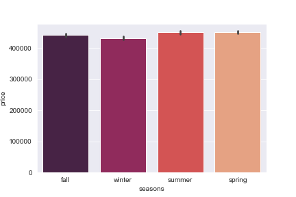
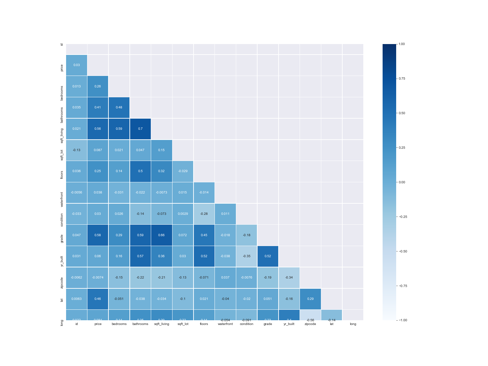
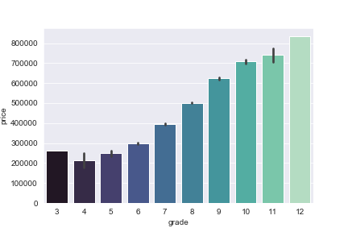
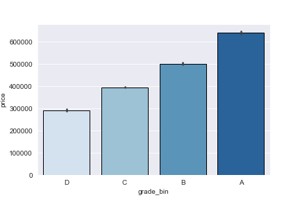
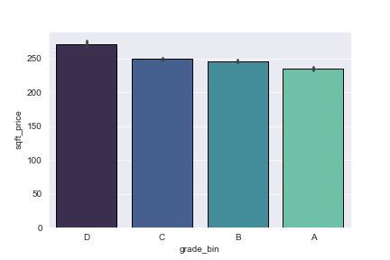
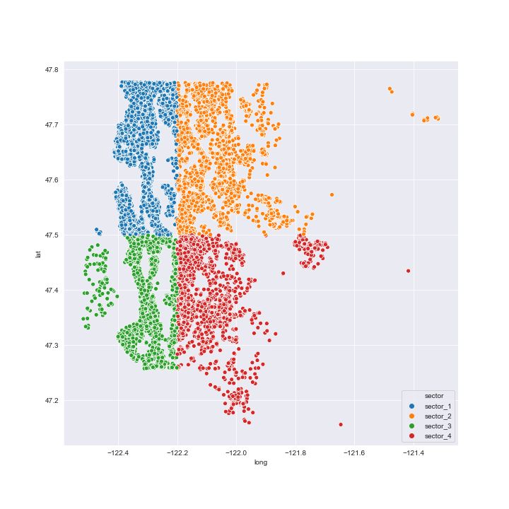
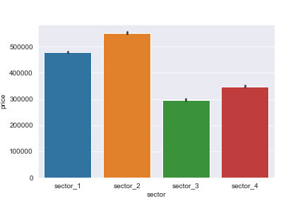

# Regression Analysis for KC House Data

Anaylzing data and using linear regression to come up with recommendations for first time 
home buyers

## Data

1. Kc_house_data.csv
2. column_name.md


## Business Problem

In order to help first time home buyers in this project we will look at some linear regression models
to analyze some house features to best determine which house is best for them.

# My Findings

## When would be the right time to look for a new house

The chart shows which season has the lowest average cost of when people bought a house.
It looks like the best time to look would be in the winter.




## Next I wanted to see what values have the best correlation to the price value



from the chart we can see that grade, sqft_living, lat, and bathrooms have the highest correlation to the price value

# what affect does each grade value does to the price?


```python
# I wanted to see if the different values of grading had any affect on the
# price of the homes which between the lowest grade and the highest grade 
# there is a difference of around $330,000 
```





between each of the grade values there is a difference of around 100,000 dollars besides grades A and B which looks like around 130,000 dollars



# Does zipcode have any affect on the price?

I split up the zipcodes into 4 different sector of the map to see what is the average price of each sector is.





# conclusion

The final model after all of the data cleaning and engineering I got a R squared value of .900.
The base model R squared was .700. so that was a nice increase from the base value meaning that from the base value i got it up to 90% of the data that could be explained by the models.

## future work

There was definitely alot to learn from this model. I would really like to get more information from the houseing renovations and see how much it affects the price by adding an extra room or more bathrooms to the houses and see if it would be worth it to do some home renovations.


```python

```
